# APK Toolbox

Track, clone, install and merge Android apps — right on the phone, no root.

APK Toolbox started as a way to get a second copy of an app next to the
original and grew into a small set of tools for APK files:

- **Sources** — track apps from GitHub, GitLab, F-Droid, app stores, Telegram
  channels and other sites, and install their new versions straight from the
  source.
- **Cloning** — make a copy of an app under a new package name and app name,
  take away the permissions it should not have, and keep the clone in step
  with the original as it gets updated: seamlessly, with its data kept.
- **A clone instead of the app** — a tracked app can be installed as a clone
  only, without the permissions you switch off, and is updated from its
  source without the original ever being on the device.
- **SAI** — install split APKs (APKS, XAPK, APKM, ZIP) and export installed
  apps as `.apks` archives.
- **AntiSplit** — merge an app that ships as several APKs into one regular APK.

One schedule and one installation method serve all of it: what is found in
the background is installed the same way whether it is a tracked app or a
clone.

Nothing is left behind on disk: a result is either installed or saved where
you choose, and temporary files are removed afterwards.

Two things it does that are hard to find elsewhere:

- **Apps from Telegram channels.** A channel that posts builds as files is
  tracked like a store: new files are found, downloaded and installed, in the
  background too.
- **A clone instead of the app, kept up to date.** An app can be installed
  only as a clone with the permissions you take away — no network, no
  contacts — and every new release is rebuilt the same way and installed
  over it, with the data kept. The original never has to be on the device.

<p align="center">
  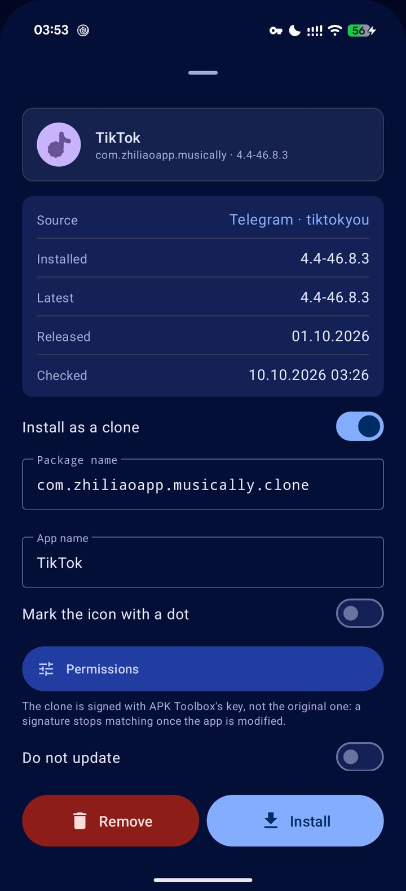
  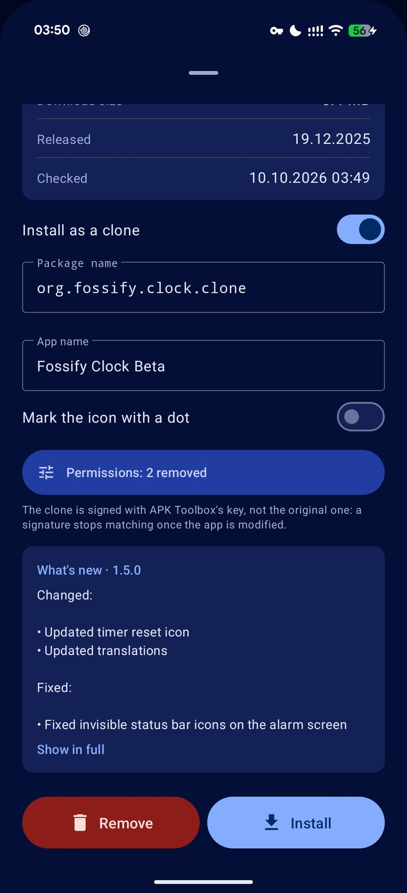
  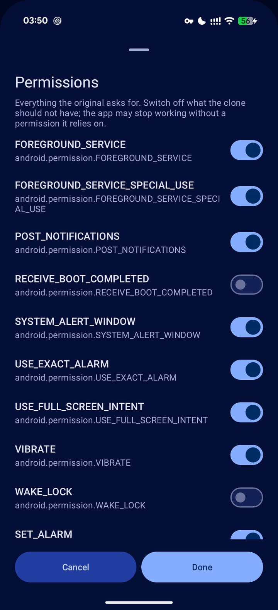
  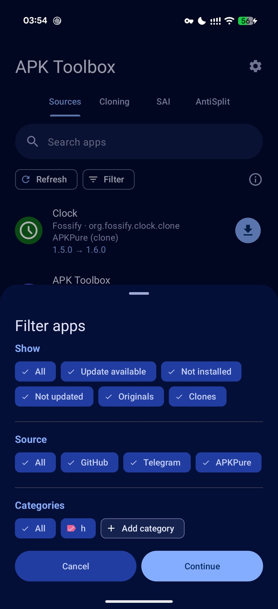
</p>
<p align="center">
  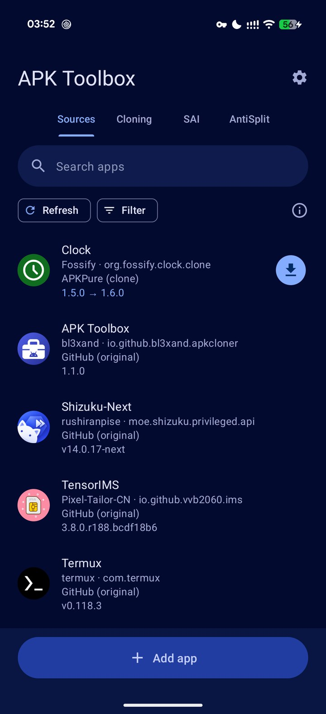
  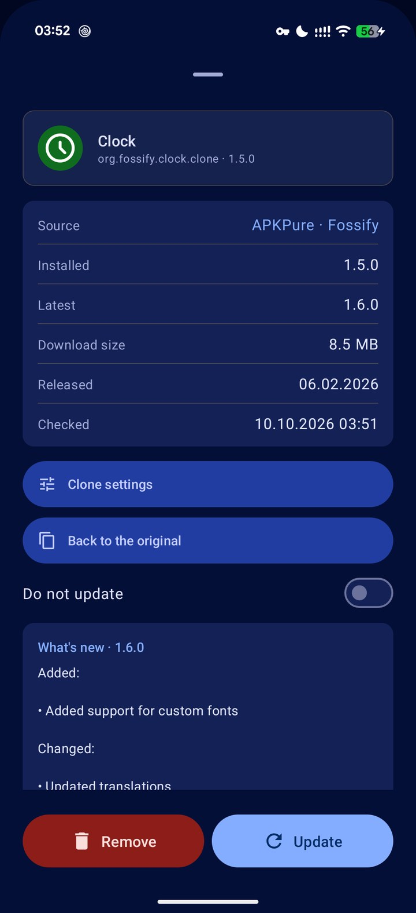
  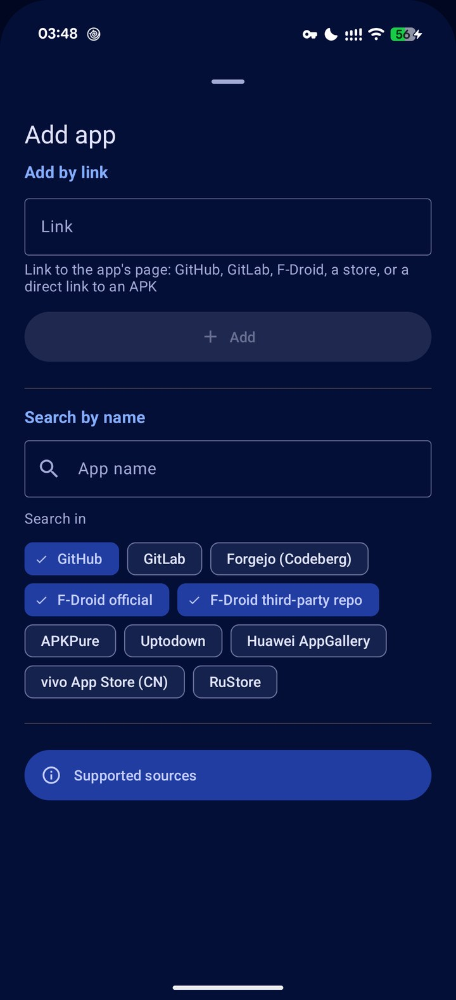
  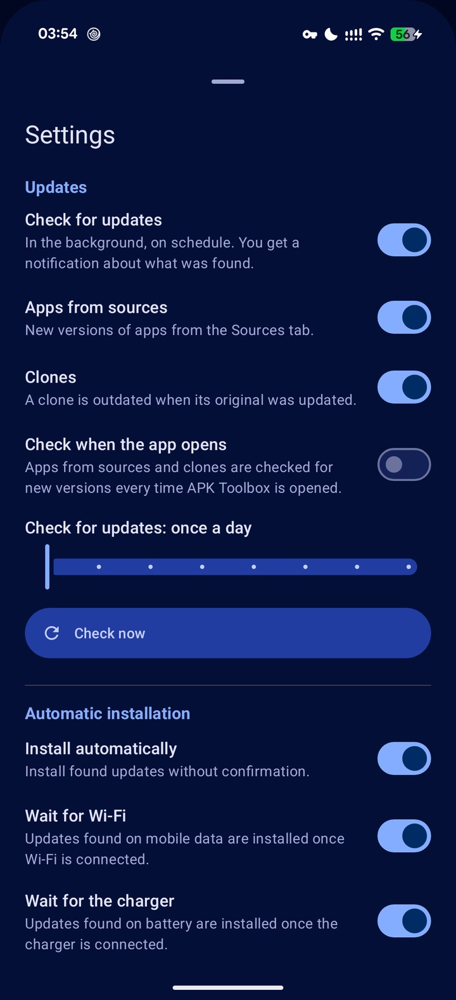
</p>
<p align="center">
  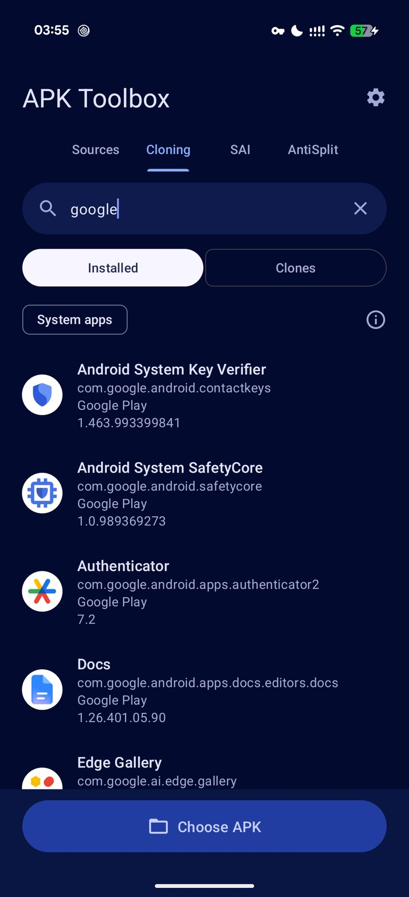
  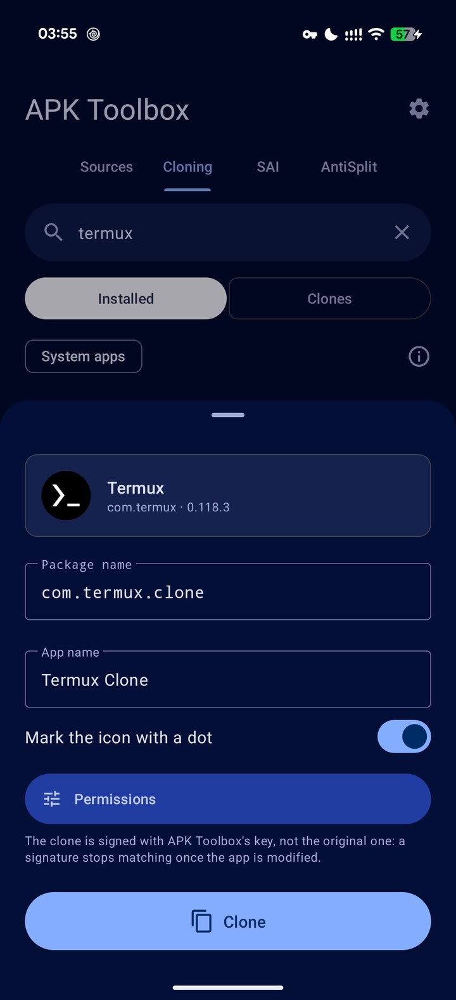
  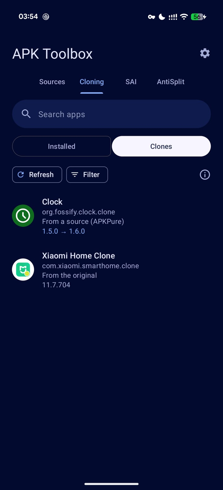
  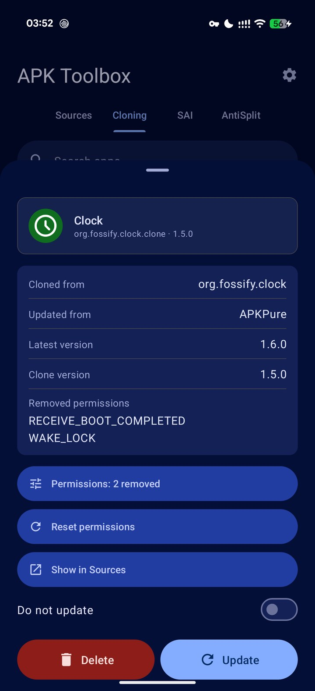
</p>
<p align="center">
  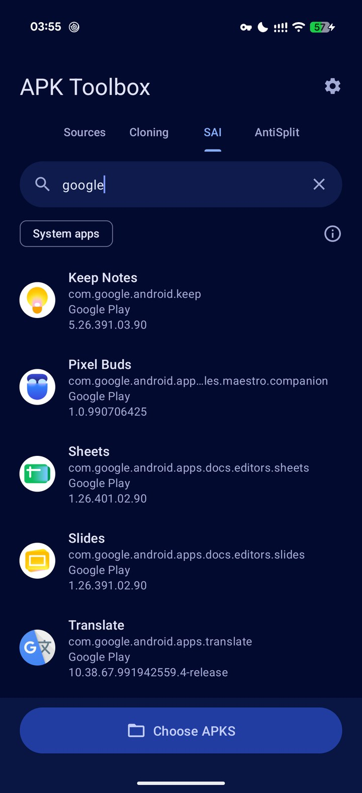
  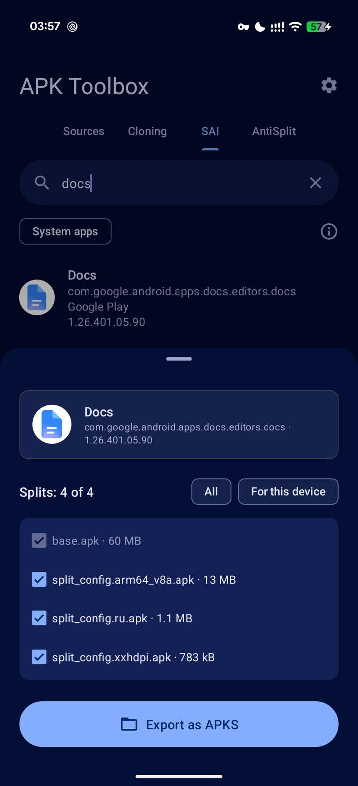
  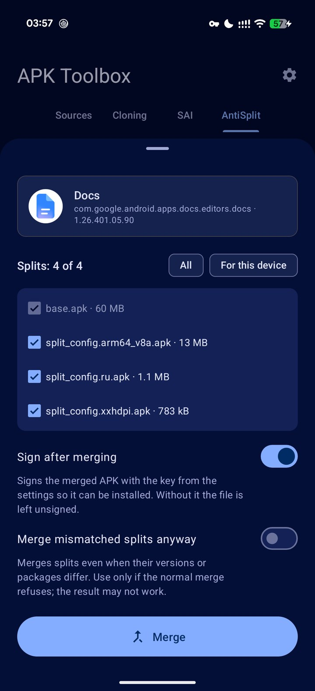
</p>

## Requirements

- Android 15 or newer
- No root needed
- [Shizuku](https://shizuku.rikka.app/) is optional — it lets apps and clones
  update without any prompts

## Getting started

Install APK Toolbox and open it. It asks for two things: access to files and
permission to install apps. After that the four tabs are ready to use. The
**i** button on each tab says what the tab is for.

## Sources — apps straight from where they are published

Add an app by the link to its page — a GitHub or GitLab repository, an
F-Droid package, a store page, a Telegram channel, a direct link to an APK —
or find it by name in the sources that can be searched (GitHub, GitLab,
Codeberg, F-Droid, APKPure, Uptodown, RuStore and a few more). APK Toolbox then knows which version is
the latest, shows what is new in it, and installs or updates the app on
request or in the background.

- Tap an app to see its versions and release notes, to **Update** or
  **Remove** it.
- Hold an app for everything else: check it now, change its options, give it
  categories, pin it, share its link, download a release file, or select
  several apps at once.
- **Filter** narrows the list by state, source and category.
- **More settings** when adding, and **App options** later, hold what a
  particular app may need: which file of a release to take, how to read its
  version, whether to update it automatically. Every option says what it does.

Access tokens, the choice of releases, the order of the list and import and
export live under **Sources settings**. Lists are stored in the format of
[Obtainium](https://github.com/ImranR98/Obtainium), so they can be moved
between the two apps in either direction, and `obtainium://` links open in
APK Toolbox.

### An app that is installed from somewhere else

When the build on the device is signed by someone else than the one being
added — a fork next to the original, say — the new one cannot go over it.
APK Toolbox says so on the app's page and tracks nothing yet: the list, and
whatever was tracked under that package before, stays as it was. **Delete
current** removes the installed build, after which the page is an ordinary
install. A different link for a package that is tracked already asks before
it replaces the source.

### Telegram channels

Channels that post apps as files can be tracked like any other source: add
the link to the channel (`https://t.me/name`), or to a message with the file.

- The files of a channel cannot be read anonymously, so this needs an
  account: **Sources settings → Telegram → Sign in**, with a phone number or
  with a QR code scanned from another device. The session stays on the
  device, encrypted with a key of the Android Keystore, and **Sign out**
  removes it.
- A channel may post one app or hundreds. What is tracked is one kind of
  file: the releases that agree in the app's name and in the words that say
  which build it is (a clone, a beta, an architecture). The version is read
  from the file's name. A channel with several kinds asks which one to
  follow, in a list that can be searched; a link to a message says so by
  itself.
- A file named some other way is not taken for a release of the app. When an
  author starts naming files differently, the kind to follow can be changed
  in **App options**.
- Only a small part of a file is fetched to learn what app it is; the whole
  file is downloaded when it is installed.

## Cloning — a second copy of an app

1. On the **Installed** side pick an app, or tap **Choose APK**.
2. Adjust the package name and the app name. The defaults are
   `<original>.clone` and "<name> Clone", or the next free number
   (`.clone2`, "Clone 2", …) if you have cloned the app before.
3. Leave **Mark the icon with a dot** on to tell the clone from the original
   on the home screen. Each clone gets its own colour. The dot is drawn on
   top of the app's own icon layers, so it works for apps of any size.
4. **Permissions** lists everything the app asks for; switch off what the
   clone should not have — the network, the contacts, the location. The
   clone is built without them, so the system never grants them.
5. Tap **Clone**, then **Install** the result or **Save** it.

The clone is a separate app with its own data, installed side by side with
the original. An app can be cloned as many times as you like.

### Keeping clones current

The **Clones** side lists every clone you have installed. Tap one to see
which app and version it was made from, to **Update** it to the original's
current version or to **Delete** it.

- **Updates are seamless.** A new version of the original is cloned again
  under the same package and signed with the same key, so it installs over
  the clone like any ordinary update: the data, the sign-ins, the icon mark
  and the removed permissions all stay.
- **Permissions can be changed at any time.** **Permissions** takes
  permissions away from a clone, or gives them back, after it was made: the
  clone is built again and installed over itself, so its data is kept.
- **A removed permission stays removed.** The choice is remembered by name.
  If a release stops asking for a permission and a later one brings it back,
  it is taken away again; it stays in the list meanwhile, so it can be
  allowed again.

**Refresh** looks at every clone and its original again and brings the
clones that are behind up to date one after another.

### A clone instead of the app

An app that asks for more than you want to give it — and cannot be denied
the network, say — does not have to be installed at all. The page of a
tracked app that is not installed has a switch, **Install as a clone**.
Switched on, it shows what a clone is always made with — the package, the
name, the mark on the icon and **Permissions** — and **Install** does the
rest:

- Every release is downloaded, rebuilt as a clone — under the clone's
  package, without the permissions you switched off — and only the clone is
  installed. Choosing permissions is optional; nothing is asked on the way.
- The clone is updated from the source like any tracked app, in the
  background too, and every update is built without the same permissions.
  The original is never on the device.
- If the publisher's signing key changes between releases, the update is
  refused the way the system would refuse it for the app itself.

The two tabs then share the clone between them. **Sources** is about where
it comes from and its updates; what it is made with is set on the clone's
own page in **Clones** — **Clone settings** on the one page and **Show in
Sources** on the other lead across. Changing the permissions of an installed
clone rebuilds it from itself and the manifest kept from its original, so
nothing is downloaded again, and installs it over itself with its data. A
release that asks for a permission no earlier one had is listed on the
app's page as **New permissions**.

An app that is installed already has **Reinstall as a clone** instead of
the switch. A clone is a separate app that starts empty — data and sign-ins
do not move over — so this asks first, and nothing about the app changes
until the clone is really installed: set up and left at that, the app stays
what it was. **Back to the original** removes the clone, with everything in
it, and installs the app as its publisher made it.

### Clones that outlive their original

A clone made from an installed app is rebuilt from that app, so it stops
being updated when the original is removed. The **Clones** list says where
each clone gets its updates: *From the original*, *From a source*, or *No
original*. Google Play hands its files to nobody else, but the same builds
are carried by other stores: **Update from a source** on a clone's page
looks the app up by its package in APKPure, RuStore, Galaxy Store and
others, one after another, and has the clone kept up to date from the first
that has it, in the Sources tab. The original can then be removed. A clone
of an app you track already is picked up the same way when its switch is
turned on. An update signed by someone else than the installed original is
refused.

### Staying at a version, and finding things

**Do not update**, at the bottom of a tracked app's page and of a clone's,
keeps it at the version it has: nothing offers or installs a newer one, and
the list says so next to the version. **Filter** on both tabs picks apps by
any of the chosen kinds — with an update, not updated, originals or clones,
from the original or from a source — by source and by category; *All*
switches every chip of a group on or off. Categories are shared between the
tabs; a clone is filed under them by holding its row.

A clone is signed with APK Toolbox's key, not the publisher's: sign-in with
Google, payments and integrity checks may not work in it.

## Updates in the background

One group of settings covers both tracked apps and clones:

- **Check for updates** — a background check, from once a day to once a
  year, for **Apps from sources**, **Clones** or both. It survives reboots.
  On its own it only notifies. **Check now** runs it at once and reports
  everything that is waiting.
- **Install automatically** — install what was found without asking.
  **Wait for Wi-Fi** and **Wait for the charger** hold an update back until
  the condition is met and then install it by themselves.
- **Installation method**:
  - **Standard** — the system installer. Without a prompt it updates only
    what APK Toolbox installed itself and what targets a recent Android
    version. Clones, being re-signed, are additionally held back while Google
    Play Protect app scanning is on.
  - **Shizuku** — installs with shell privileges, with no prompts, for any
    app. After a reboot the check waits for Shizuku to be started.

**Check when the app opens** is separate from the schedule: with it on,
tracked apps and clones are looked at again every time APK Toolbox is
opened.

Whatever could not be updated automatically is reported in a notification.
An install you start by hand always goes through the system installer.

Installing through root is available as an experimental switch. It has not
been tested on a rooted device.

<p align="center">
  
  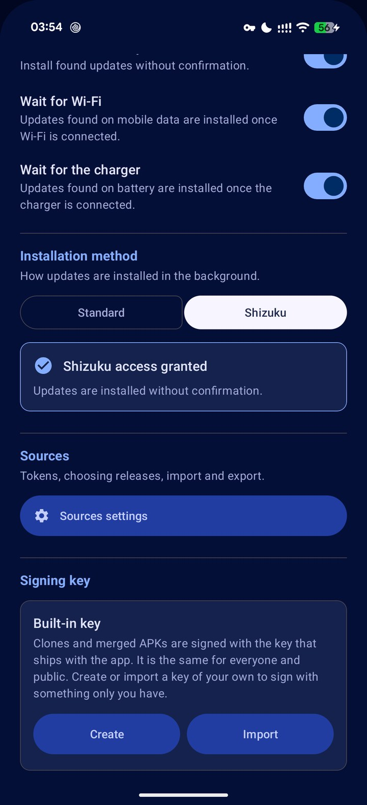
</p>

## SAI — split APKs in, `.apks` out

- **Choose APKS** installs a bundle (APKS, XAPK, APKM, ZIP), several
  split APK files or a single APK as one app. Pick which splits to include —
  all of them, or only those this device needs — and optionally re-sign them
  first. OBB expansion files inside an XAPK are copied to where the app
  expects them.
- Tap an installed app to **Export** it as an `.apks` archive. The archive
  carries the icon and metadata in the format
  [SAI](https://github.com/Aefyr/SAI) defined, so other tools recognise it.

## AntiSplit — merging into one APK

Turns an app that comes as several APKs into a single regular APK.

- Pick an installed split app, tap **Choose split APK files**, or share /
  open the files into APK Toolbox from another app.
- Choose the splits: all, or only the ABI, screen density and language this
  device uses.
- **Merge**, then install or save the result as `<name>_antisplit.apk`.

Splits whose version or package differs from the base are refused unless you
allow merging them anyway. Apps protected by PairIP are left unsigned, since
a re-signed build of such an app would not start.

Merging decodes the app's resource tables in memory, which takes about twenty
times their size, and Android caps what an app may use. Apps whose tables
come to more than roughly 20 MB are therefore refused with a message rather
than merged; those are better merged on a computer with
[APKEditor](https://github.com/REAndroid/APKEditor).

## Signing key

Everything APK Toolbox produces has to be signed, and the original signature
cannot be kept: it stops matching as soon as the APK is modified. Out of the
box a built-in key is used. It is the same for every copy of the app and its
private half is in this repository, so anyone could sign with it.

In settings you can **Create** a key of your own or **Import** one from a
PKCS#12 (`.p12`, `.pfx`) or BKS keystore. Your key is stored encrypted in the
app's private storage. **Export** it and keep the file: clones can only be
updated with the key they were signed with, and the key is gone if the app is
uninstalled. Clones made with the built-in key keep updating with it.

<p align="center">
  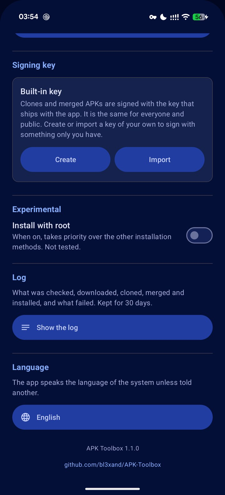
</p>

## Good to know

- A merged APK is signed with a different key than the original from a store,
  so it cannot be installed over it — the original has to be removed first.
- Google Play Protect treats re-signed apps as unknown and may block them,
  including installs you start by hand. It may also object to APK Toolbox
  itself, as an app that installs other apps.
- Cloning changes the manifest and the package name in the resource table,
  nothing else. Apps that check their own package name or signature, and
  services bound to them (Google sign-in, Firebase, in-app purchases), may
  not work in a clone.
- A cloned app made of split APKs is saved as a single `.apks` archive.

## Log

**Settings → Show log** tells what the app did and what failed: checks,
downloads, clones, merges, installs, changes of settings. It is kept for 30
days, can be narrowed to a period and to any set of levels, and **Save**
writes what is shown to a `.log` file.

## Building

```
./gradlew assembleRelease
```

A release build is shrunk and obfuscated with R8. It is signed if a
`keystore.properties` file (`storeFile`, `storePassword`, `keyAlias`,
`keyPassword`) is present in the project root, and left unsigned otherwise.

Telegram channels need the app's own API id and hash from
[my.telegram.org](https://my.telegram.org). Copy `telegram.properties.example`
to `telegram.properties` and fill them in; the file stays out of git. Without
it the app builds and the Telegram source says it is not available.

## Used projects

APK Toolbox stands on other people's work. It is not an attempt to replace
any of these apps, and it is made with respect for the effort that went into
them — the author simply finds it convenient to have everything in one place.
If one of these tools does all you need, use it and support its author.

⭐ [Obtainium](https://github.com/ImranR98/Obtainium) by ImranR98 — the Sources tab is a port of it: the sources, the update checks, the storage format and most of the texts

⭐ [AntiSplit-M](https://github.com/AbdurazaaqMohammed/AntiSplit-M) by AbdurazaaqMohammed — the split merging feature follows its functionality

- [APKEditor](https://github.com/REAndroid/APKEditor) and [ARSCLib](https://github.com/REAndroid/ARSCLib) by REAndroid — the merge itself
- [SAI](https://github.com/Aefyr/SAI) by Aefyr — the model for installing split APKs and the `.apks` export format
- [Shizuku](https://github.com/RikkaApps/Shizuku) by RikkaApps — installing without prompts
- [TDLib](https://github.com/tdlib/td), in the Android build by [tdlibx](https://github.com/tdlibx/td) — reading and downloading the files of Telegram channels
- [ZXing](https://github.com/zxing/zxing) — the QR code of a Telegram sign-in
- [apksig](https://android.googlesource.com/platform/tools/apksig/) from the Android Open Source Project — signing APKs
- [jsoup](https://jsoup.org/), [jBCrypt](https://www.mindrot.org/projects/jBCrypt/), [Apache Commons Compress](https://commons.apache.org/proper/commons-compress/) and [XZ for Java](https://tukaani.org/xz/java.html) — reading what the sources publish

## License

[GPL-3.0](LICENSE). The Sources tab derives from Obtainium, which is
published under the same licence.
